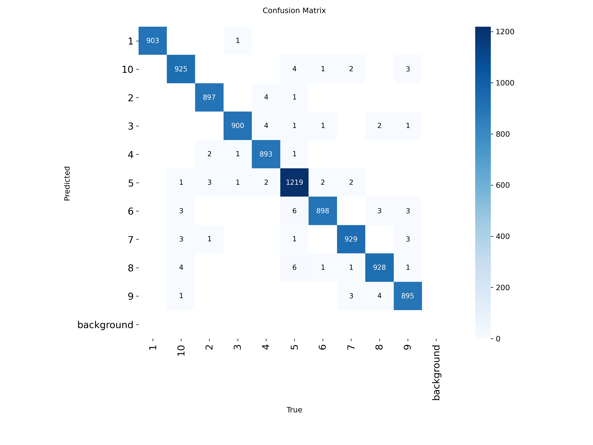

# 🎯 Player Jersey Number Recognition

## 📌 Introduction
This project focuses on recognizing football players and their jersey numbers by combining two deep learning tasks:
1. **Object Detection** – detecting players on the field.  
2. **Classification** – classifying jersey numbers from cropped player images.  

The final output is a video where each player is detected and their jersey number is displayed.

---

## 📂 Project Structure

- **classifier/** – dataset and training scripts for jersey number classification.  
- **detection/** – dataset and training scripts for player detection.  
- **football_train/** – raw annotations in JSON format.  
- **DATA_IMAGES/** – extracted frames from videos.  
- **DATA_LABELS/** – label files.  
- **inference** – run detection + classification on video input.
- **prepare_data - script prepare data
---

## ⚙️ Data Preparation
- Extract frames from raw videos.  
- Use JSON annotations (`football_train/`) to crop player images into a classification dataset organized by jersey number.  
- Datasets for both detection and classification follow the YOLO format.  

---

## 🚀 Training
- Train the **detection model** using YOLO for player detection.  
- Train the **classification model** using YOLO for jersey number recognition.  
- Pretrained YOLOv8 weights are used as a starting point.  

---

## 🎥 Inference
- Run the pipeline script to combine detection and classification on video input.  
- Each frame is processed, players are detected, cropped, and their jersey numbers classified.  
- The final annotated video is saved to `test_result/output_with_jersey.mp4`.  

---

## ⚙️ Installation
1. Clone the repository.  
2. Create a Python virtual environment and install dependencies from `requirements.txt`.  
3. Place datasets (images, annotations, videos) in the corresponding folders.  

---

## ▶️ Quick Usage
- Train detection: run the detection training script.  
- Train classification: run the classification training script.  
- Run inference: execute the pipeline to generate an annotated output video.  

---

## 🚀 Training Results

### 🟢 Object Detection
- Player detection results on test data:  

- Detection labels:  

- Confusion Matrix:  

---

### 🔢 Classification
- Classification results on test data:  

- Confusion Matrix:  

- Normalized Confusion Matrix:  

---

## 🎥 Final Pipeline
- Combined pipeline detects players and predicts jersey numbers on video.  
- Output video example is saved in:
[
